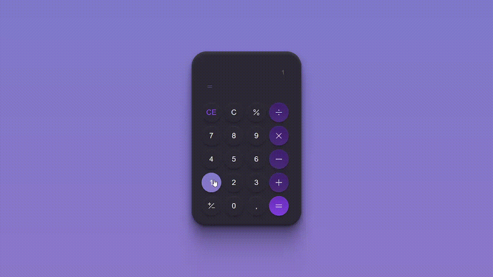

<h1 align="center"> Bora Code Quinto Desafio </h1>

# Diário de bordo 

| DIA | HORAS|
|---|---|
| 01/02 | 01:50 | 
| 02/02 | 01:41 |

## Tempo codando cada arquivo wakatime

| HTML | CSS | JavaScript|
|---|---|---|
| 1h 15m | 47m | 1h 29m |

# Projeto

Esse é o quinto desafio do bora code, tendo como intuito de criar uma calculadora.

# Link

> <https://gustav0dedeus.github.io/BoraCode-5/>

# Linguagens

* <h2>HTML</h2>
* <h2>CSS</h2>
* <h2>JS</H2>
